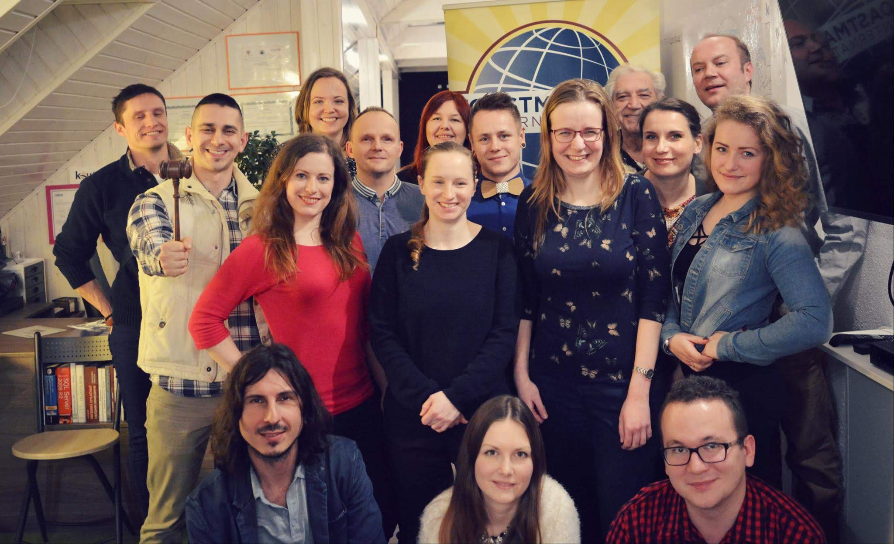
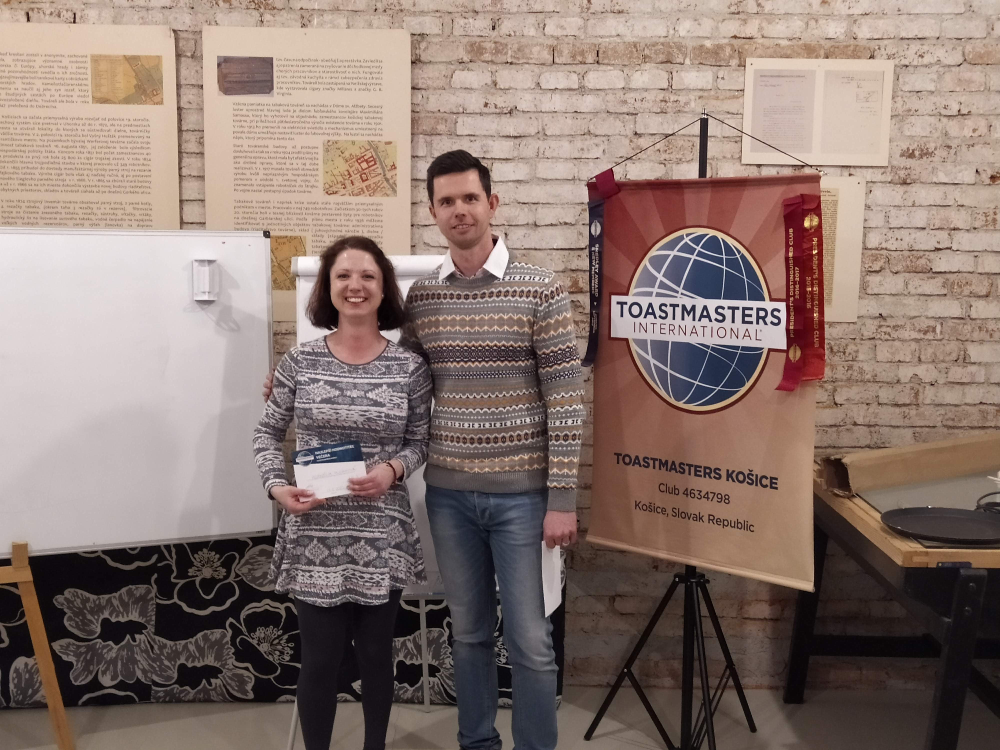

V klube [Toastmasters Košice][tmke] som od marca 2018, do vedenia som vstúpil v decembri 2018. Dá sa povedať, že klub v tejto chvíli poznám asi ako málokto. Už dlhšie však vnímam, a nie som sám, že klubu hrozí zánik.

## Klub bez členov končí
Náš klub mal vo svojej histórii aj svetlé chvíľky. Keď som doňho vstúpil, mal cez 20 členov. Dokonca pod naším klubom fungovali aj členovia Toastmasters Tatry. Tí nemali dostatok členov na založenie samostatného klubu (poznámka: hlúpe pravidlá [Toastmasters International][tmi]), tak sme ich prichýlili my.

  
  <figcaption>Bývalí členovia</figcaption>

Nič však netrvá večne. Krátko po mojom príchode nastal veľký odchod členov z klubu. Asi sa už naučili, čo potrebovali, a šli ďalej. A postupne sa takto rozpŕchli aj členovia v Poprade. Od septembra 2018 sme sa výrazne zmenšili, bolo nás možno trinásť. A pravidelne sme na stretnutia chodili možno ôsmi. Tu začal náš postupný úpadok.

Vo vedení klubu pôsobili ešte rok aj starší členovia. Od septembra 2019 však už aj tí opustili klub. Vlastne ich odchodom sa náš klub úplne zmenil. Všetci, čo sme v ňom boli, azda až na jedného, sme boli noví ľudia. Nikto z nás v klube nepôsobil dlhšie ako rok a pol.

Ja, podobne ako ostatní vedúci, som začal plný elánu. Bral som to ako príležitosť vytvoriť si taký klub, aký som vždy chcel mať. A myslím si, že sa to mne spolu s ďalšími aj podarilo. Pravidelne dostávame pochvalu od ľudí z iných klubov, aké kvalitné dávame prejavy, akú má náš klub úroveň. Avšak to je druhoradé. Pokiaľ klub dlhodobo nie je schopný prilákať nových ľudí, končí.

Za tie roky sa zo mňa stal tak trochu aj psychológ. Často som vedel už pri letmom rozhovore odhadnúť, či to člen myslí vážne, či chce makať, alebo prišiel len preto, že má pocit, že by to mohlo byť preňho dobré. Takí ľudia, ktorí sami nechcú na sebe pracovať, ale sa chcú nechať ťahať, vždy veľmi rýchlo skončia. Nie preto, že by sme ich od seba odháňali. Končia preto, lebo nikdy vlastne ani nemali potrebu rečniť a keď im to dôjde, už ich niet.

Dalo sa to poznať aj na nízkom záujme o [mentoring][mentoring]. My ako skúsení členovia sme ponúkali každému individuálny prístup. Venovali sme náš čas, aby sme potiahli ostatných. Aby aj vďaka nám rástli a aby sme spoločne klub pozdvihli. Keď sa spätne zamyslím, tých ľudí, ktorí mali o mentoring skutočne záujem, spočítam na prstoch jednej ruky.

  
  <figcaption>Ocenenia v klube</figcaption>

Pred covidom sa zdalo, že náš klub sa pomaly rozbieha. Členská základňa sa zväčšovala, ale potom prišla ťažká skúška. Boli sme nútení prejsť na online stretnutia. Mnohých to odrádzalo. Niektorí aj chvíľu chodili, ale potom prestali. Postupne nám členovia ubúdali, až sme sa opäť dostali na hranicu ohrozenia a hrozil nám zánik.

## Zdravé jadro
Keď sa na klub pozerám v širšom kontexte, vidím ho ako loďku na rozbúrenom mori, ktorej posádka len dúfa, že ustojí plavbu do rána a zakotví v prístave. Tú našu posádku tvoríme stabilne asi štyria, občas sa pridá ešte niekto ďalší.

Všetci sme prišli do klubu preto, že sme sa chceli učiť a pracovať na sebe. Všetkým nám dal klub veľa, lebo sme sa nebáli si to vypýtať. A zároveň sme chceli odovzdať to, čo sme sa naučili, ďalej. Chceli sme klubu pomôcť a posunúť štafetu ďalej. Takých ľudí, ako my, však bolo v klube vždy ako šafranu. A nielen v klube... Azda aj v celých Košiciach.

Pre mňa osobne je Toastmasters Košice trochu ako vlastné dieťa. Obetoval som klubu stovky hodín neplatenej práce a nie je mi jedno, čo s ním bude. Robil som všetko preto, aby som klubu pomohol prežiť ťažké časy. Ale podnikanie ma naučilo, že ak niečo nefunguje, treba sa toho pustiť.

## Prečo neustále bojujeme o členov?
Tých dôvodov je niekoľko. V prvom rade vidím problém v existujúcich členoch, tých bývalých aj súčasných. Väčšina z nich prišla do klubu zo sebeckých dôvodov, že sa chcú naučiť rečniť. To je mimochodom úplne v poriadku. Avšak akonáhle sa to naučili do tej miery, že s tým boli spokojní, dvihli sa a odišli preč.

My však nie sme nejaká firma, kde si zaplatíte školenie a po skončení idete preč. Sme komunitný klub, a ten funguje len vtedy, ak aj fungujeme spolu, ako komunita. Vnímam, že až na zopár z nás nikto vo svojom okolí nehovorí, že chodí do Toastmasters. Skoro nikto nerobí ambasádora nášmu klubu. Klubom prešlo za tie roky aj zopár ľudí, ktorí to už niekam dotiahli. Ani u nich nevnímam, že by klub aspoň občas spomenuli a oplatili mu láskavosť. Akoby zabudli, že tam hore sa dostali aj vďaka členstvu v Toastmasters.

A keď aj otvorene členom povieme, že sme v problémoch, a žiadame ich o pomoc, väčšina z nich nás ignoruje. Klub im vyhovuje, kým funguje. Ale ak skončí, len sa zoberú a idú ďalej. S takýmto prístupom sa však fungovať nedá. Chýbajú akékoľvek náznaky súdržnosti a podpory, žiaľ.

Som však rád, že sú medzi nami aj ľudia ako ja, ktorí sa úprimne snažia klubu pomôcť a nie je im jedno, čo s ním bude.

Ďalší problém sú noví potenciálni členovia. Myslím si, že na sociálnych sieťach aj inde sme aktívni. Robíme dobrú prácu v tom, že ľuďom približujeme priateľskú atmosféru v klube a zároveň im ukazujeme potenciál, čo sa môžu naučiť.

Robili sme dokonca aj vzdelávací kurz v spolupráci s knižnicou. Odtiaľ mám ďalší dôležitý poznatok: ľudia o nás vedia. Jeden z účastníkov, Jakub, nám prezradil, že o našom klube vedel už dlhšie, ale nechcel prísť. Nechcel rečneniu venovať viac ako pár týždňov svojho života, pritom učiť sa rečniť je dlhodobý proces.

  <YouTube videoId="qcxR8l6w494" />

Takých ako on bude veľa. Chcú vedieť rečniť, pretože sa im to hodí v práci, pri pohovoroch, ale to sú všetko zástupné dôvody. Myslím si, že väčšina ľudí sa v skutočnosti nechce naučiť rečniť. Nie sú pripravení na tom dlhodobo pracovať a odmakať si to.

Keď to skrátim, myslím si, že sme v povedomí. Už len cezo mňa o Toastmasters vedia asi všetci moji známi. Ak neprídu, tak je to preto, že nechcú. Nie preto, že o nás nevedia.

Už som to v [jednom blogu][leaders] písal, ale zopakujem to: Ľudia chcú byť vedení. Chcú niekam prísť, popočúvať si hodinku niekoho iného a ísť domov. U nás sa očakáva proaktivita, a zrejme tá ľudí odrádza. Nás, ktorí sme pripravení systematicky chodiť mimo komfortnej zóny je zúfalo málo.

V neposlednom rade je tu aj covid. Ten prispel k obrovskej nestabilite v klube, ktorú cítime dodnes. Chvíľu sme fungovali na osobných stretnutiach v [Tabačke v Košiciach][tabacka]. Neskôr sme čakali čo bude. Potom sme prešli do online prostredia. Teraz sa opäť stretávame v Tabačke a nikto nevie dokedy.

  
  <figcaption>Online stretnutie</figcaption>

Tieto zmeny odradili azda všetkých členov okrem tých, ktorým klub nebol ľahostajný. Ako dôsledok sa naša členská základňa výrazne zmenšila. A aj na nás bolo cítiť únavu.

Predstavte si, že musíte každý týždeň dávať prejavy, pretože pomaly nemá kto. Časom nás to prestávalo baviť, boli sme vyšťavení. Mali sme už aj stretnutia bez prejavov a stretnutia s jedným prejavom boli štandard. Skrátka, aby klub napredoval, potrebuje variabilitu. Chceme a potrebujeme si skúšať rôzne roly a nie ťahať stretnutia tak, že ako členovia vezmeme po dve-tri roly. Stretnutia majú byť zábava, nie povinnosť. Dlhodobo sa takto fungovať nedá a je to cítiť.

## A čo ostatné kluby?
Situácia u nás nie je ojedinelá. Bojujú s ňou skoro všetky kluby Toastmasters na Slovensku. Azda s výnimkou [Slovenských Toastmasters][slovenski-tm] máme všetci malé členské základne a mnohí sme aj na hranici ohrozenia. Myslím si, že väčšina z toho, čo som napísal za náš klub, platí aj u tých ostatných. Niekde sú zárodky komunity lepšie, inde horšie... Ale spolupráca medzi klubmi je dlhodobo na bode mrazu.

Keď som videl, že členovia nevedia po anglicky, a videl som potrebu preložiť softvér easy-Speak, ktorý používame na plánovanie stretnutí, urobil som to. Ja konám, nečakám na druhých.

Dám vám však iný príklad: Na jednom školení vedúcich sme sa dohodli, že začneme ako kluby tvoriť vlastnú Wikipédiu a dávať dokopy naše skúsenosti. Ja som v priebehu jedného dňa dal dokopy funkčné riešenie, ktoré si mohli všetci hneď vyskúšať. „Vlado, spravil si kus práce. Hneď to pôjdem vyskúšať... Mali by ti dať metál za to, čo robíš.“ Výsledok? Nikto si to napriek rečiam ani nepozrel, vyčítal som to zo záznamov na serveri.

Mám pocit, že tým ľuďom ide v prvom rade o plnenie svojich projektov, ako napríklad High-Performance Leadership, a o skutočnú pomoc komunite Toastmasters im v skutočnosti takmer vôbec nejde.

Jeden kolega z Levíc sa snažil o zjednotenie klubov Toastmasters, aby sme vystupovali pod spoločnou značkou. Aj z toho vyšumelo. Podobne ako ja, narazil len na prázdne reči a skutky chýbali. Ako chceme mať úspešné kluby, keď každý kope sám za seba? To, čo sa deje na úrovni členov, sa deje aj na úrovni vedenia. Sme ako komunita rozdrobení, okrem spoločných súťaží si takmer nepomáhame. Nezdieľame riešenia na problémy, ktoré nás trápia. Nezapisujeme si ich. Nekomunikujeme spolu.

## Budúcnosť Toastmasters na Slovensku
Myslím si, že budúcnosť je neistá. Môže to dopadnúť ešte všelijako. Aktuálny stav nie je povzbudivý, ale ešte stále sa dá zmeniť. Musíme však úprimne chcieť spolupracovať a robiť niečo preto, aby sme sa naozaj pohli. Nie iba o tom rozprávať.

Mnohé kluby tiež brzdí aj zotrvačnosť. Nejako doteraz fungovali, tak prečo by to mali meniť? Nuž, aj keď to nemusí byť hneď zjavné, môže to hrať veľkú rolu. Čo ak nemáme členov preto, že nie sme definovaní ako klub, slúžime všetkým a zároveň nikomu? Alebo čo ak sú stretnutia pre ľudí pridlhé? Na takéto otázky by sme mali zbierať odpovede a to neustále. Situácie aj kluby sa menia.

Čo sa nášho klubu týka, jeseň bude kritická. Koncom septembra by sme si mali obnoviť členské. Je však možné, že nás bude už tak málo, že to klubu zlomí väz. Nadšený z toho síce nebudem, ale neberiem to ako tragédiu. Viem, že sme spravili ako vedúci v našom klube, čo bolo v našich silách. Som hrdý na to, čo sme dokázali, kam sme klub posunuli. A budem spomínať aj na našu spoločnú turistiku, z ktorej bola cítiť úprimná radosť všetkých zúčastnených.

  <YouTube videoId="bLA3Iw312S4" />

Každý začiatok má aj koniec, je to prirodzená súčasť života. Nastane už v septembri? Uvidíme...

*Po dopísaní tohto príspevku som aj naďalej premýšľal nad naším klubom a rozhodol som sa z klubu vystúpiť. Už dávno to pre mňa nebolo v prvom rade o zábave, ale skôr o povinnosti. Klub som sa však snažil zachraňovať dva a pol roka a už stačilo. Nepáči sa mi, ako v klube problémy riešime, ale zároveň už nechcem byť ten, ktorý za to prijíma zodpovednosť. Ak niečo nefunguje, tým, že to budeme skúšať opakovane, sa výsledok nezmení. Treba experimentovať a na to klub nie je pripravený. Cítil som, že ak by som pôsobil v klube aj naďalej a pokúšal sa riešiť všetky problémy, mohlo by mi hroziť aj vyhorenie. Potrebujem si od Toastmasters oddýchnuť, aspoň na čas...*

[//]: # (Used references)
[tmke]: https://www.toastmasterskosice.sk/
[tmi]: https://www.toastmasters.org/
[tabacka]: https://www.tabacka.sk/
[slovenski-tm]: https://slovenski.toastmasters.sk/
[mentoring]: https://www.zahradnik.io/sila-mentoringu
[leaders]: https://www.zahradnik.io/svet-potrebuje-lidrov